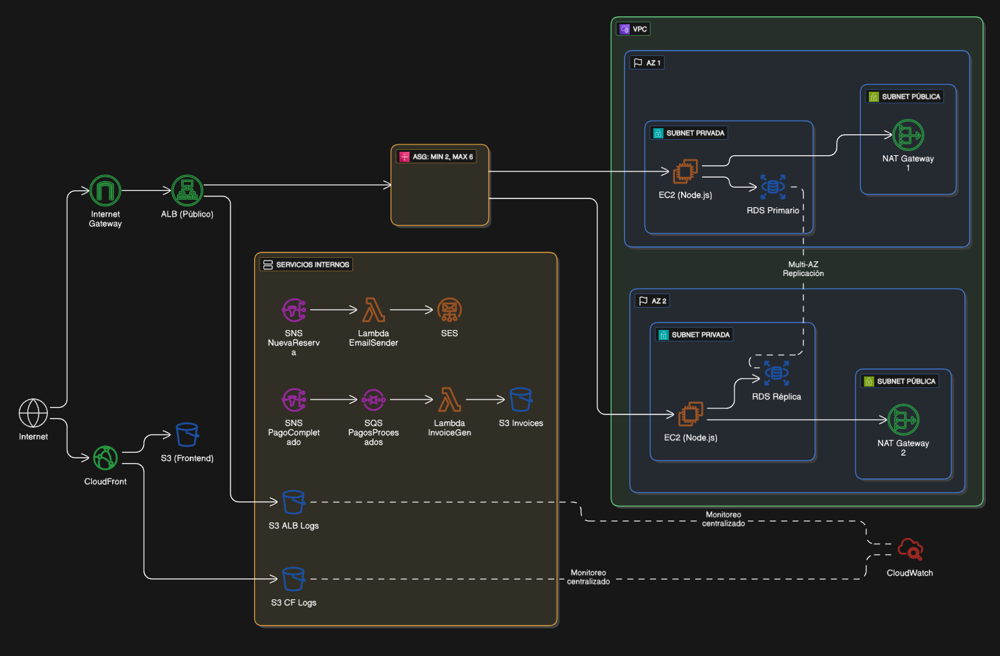

# Sistema de Reservas de Hotel - Arquitectura Monolítica



## Resumen de la Arquitectura

La arquitectura se divide en dos partes principales: un frontend público servido desde S3 a través de CloudFront (CDN), y un backend consolidado en una única aplicación monolítica que se ejecuta en instancias EC2, con servicios de AWS para mensajería y colas.

### Componentes Principales

#### 1. **Frontend (S3 + CloudFront)**

- Archivos estáticos servidos desde S3
- CloudFront CDN para baja latencia global
- Origin Access Identity (OAI) para acceso seguro
- Versionado y encriptación habilitados

#### 2. **Backend Monolítico (EC2 + ALB + ASG)**

El backend se consolida en una sola aplicación monolítica que se ejecuta en instancias EC2. Un Application Load Balancer distribuye el tráfico, y un Auto Scaling Group gestiona un mínimo de 2 instancias para alta disponibilidad.

- **EC2**: Instancias privadas con Docker
- **Application Load Balancer (ALB)**: Distribuye tráfico entre instancias
- **Auto Scaling Group (ASG)**: Mínimo 2 instancias, máximo configurable

#### 3. **Base de Datos (RDS)**

En lugar de múltiples bases de datos separadas, se utiliza una única instancia RDS con Multi-AZ. Los datos de autenticación, reservas, clientes y pagos pueden existir en diferentes esquemas dentro de esa base de datos.

- PostgreSQL 15.4
- Multi-AZ para alta disponibilidad
- Backups automáticos (7 días)
- Encriptación de almacenamiento

#### 4. **Mensajería Asincrónica**

**Amazon SQS (Simple Queue Service)**
Cuando el módulo de Pagos procesa un pago, envía un mensaje a una cola SQS "PagosProcesados". Un consumidor (Lambda) lee de esta cola para procesar esas tareas en segundo plano.

- `pagos-procesados`: Para procesamiento de pagos
- `emails`: Para envío de correos
- Dead Letter Queues para reintentos fallidos

**Amazon SNS (Simple Notification Service)**
Cuando se crea una nueva reserva, el monolito publica un mensaje en un tópico SNS llamado "NuevaReserva". Múltiples servicios pueden suscribirse a este tópico para ejecutar tareas específicas.

- `nueva-reserva`: Publicado cuando se crea reserva
- `reserva-cancelada`: Publicado cuando se cancela
- `pago-completado`: Publicado después de pago exitoso

#### 5. **Funciones Lambda (Procesamiento Asincrónico)**

Las funciones Lambda son disparadas por eventos de SQS/SNS para manejar tareas específicas de forma asincrónica, como enviar correos de confirmación o generar facturas.

- **email-sender**: Envía correos de confirmación
- **invoice-generator**: Genera facturas en PDF

---

## Estructura de Carpetas Terraform

```
IAC/
├── main.tf                    # Orquestación de módulos
├── variables.tf               # Variables globales
├── terraform.tfvars          # Valores de variables
└── modules/
    ├── vpc/
    │   ├── main.tf
    │   ├── variables.tf
    │   └── outputs.tf
    ├── rds/
    │   ├── main.tf
    │   ├── variables.tf
    │   └── outputs.tf
    ├── sqs/
    │   ├── main.tf
    │   ├── variables.tf
    │   └── outputs.tf
    ├── sns/
    │   ├── main.tf
    │   ├── variables.tf
    │   └── outputs.tf
    ├── lambda/
    │   ├── main.tf
    │   ├── variables.tf
    │   └── outputs.tf
    ├── ec2-monolith/
    │   ├── main.tf
    │   ├── variables.tf
    │   ├── outputs.tf
    │   └── user_data.sh
    └── s3-cloudfront/
        ├── main.tf
        ├── variables.tf
        └── outputs.tf
```

---

## 🚀 Requisitos Previos

- **Terraform** >= 1.0
- **AWS CLI** configurado con credenciales
- **Docker** (para construir imagen del backend)
- **Node.js** >= 18 (para frontend y Lambda)

---

## 📦 Configuración Inicial

### 1. Clonar o descargar el proyecto

```bash
cd IAC
```

### 2. Inicializar Terraform

```bash
terraform init
```

### 3. Configurar variables

Editar `terraform.tfvars`:

```hcl
aws_region       = "us-east-1"
project_name     = "sistema-reserva-hotel"
environment      = "dev"
db_password      = "TuContraseñaSegura123!"  # CAMBIAR EN PRODUCCIÓN
backend_image    = "tu-registry/hotel-backend:latest"
```

### 4. Validar configuración

```bash
terraform validate
terraform plan
```

### 5. Aplicar infraestructura

```bash
terraform apply
```

---

## Flujo de Datos

```
1. Usuario accede al sitio (CloudFront/S3)
   ↓
2. Llamadas API → API Gateway → ALB
   ↓
3. ALB distribuye carga → EC2 (monolito)
   ↓
4. Lógica de negocio en monolito (Auth, Reservas, Pagos)
   ↓
5. Lectura/escritura en RDS consolidada
   ↓
6. Para tareas async (pagos, emails):
   - Monolito publica a SNS o envía a SQS
   ↓
7. Lambda es disparada por SQS/SNS
   ↓
8. Lambda ejecuta tarea (email vía SES, factura, etc.)
```

---

## Seguridad

- **VPC**: Subnets públicas/privadas con NAT Gateways
- **Security Groups**: Restricciones de tráfico por servicio
- **RDS**: Multi-AZ, encriptación, backups automáticos
- **S3**: Acceso bloqueado públicamente, OAI para CloudFront
- **Lambda/EC2**: Roles IAM con permisos mínimos necesarios
- **Bases de datos**: Contraseña requerida, sin hardcoding en código

---

## Monitoreo

- **CloudWatch**: Logs centralizados
- **Auto Scaling**: Basado en CPU
- **ALB Health Checks**: Verificación cada 30 segundos
- **RDS Enhanced Monitoring**: Métricas detalladas

---

## Limpieza

Para eliminar toda la infraestructura:

```bash
terraform destroy
```

---
