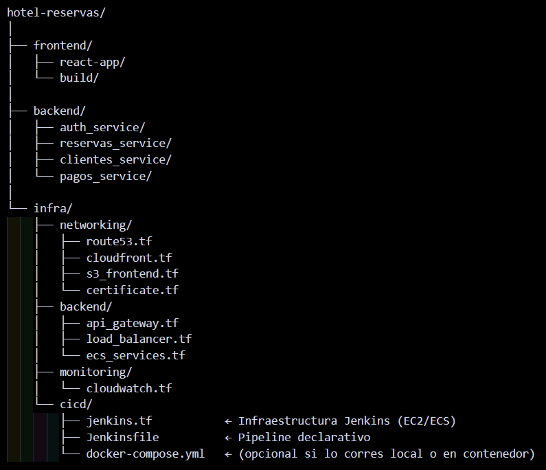

# Sistema de Reservas de Habitaciones de Hotel

## Resumen del Problema

El proceso tradicional de reserva de hotel (presencial, telefónico o por WhatsApp) presenta varias **limitaciones**:

- **Dependencia del personal:** La atención está supeditada a la disponibilidad del equipo, lo que puede generar **demoras y errores** en la gestión.
- **Disponibilidad desactualizada:** Las comunicaciones manuales no siempre garantizan una **actualización inmediata** del inventario de habitaciones.
- **Procesos de gestión complejos:** Las modificaciones o cancelaciones requieren **contactar nuevamente** al hotel, añadiendo pasos innecesarios.
- **Riesgo en los pagos:** Los pagos presenciales o transferencias manuales carecen de la **trazabilidad y seguridad** necesarias.

## Ventajas del Sistema Web

Nuestro sistema de reservas web ofrece una solución moderna y eficiente:

- **Disponibilidad en Tiempo Real:** Los clientes ven el inventario de habitaciones **actualizado al instante**.
- **Confirmaciones Automáticas:** Se eliminan los retrasos con **confirmaciones inmediatas**.
- **Gestión Segura de Pagos en Línea:** Implementación de plataformas de pago con **trazabilidad y seguridad** garantizadas.
- **Autogestión del Usuario:** Los clientes pueden **modificar o cancelar** sus reservas sin depender de terceros.
- **Experiencia Rápida y Confiable:** Un flujo de usuario optimizado para una **interacción fluida**.

---

## Tecnologías Utilizadas

| Componente          | Tecnología          | Propósito Principal                                       |
| :------------------ | :------------------ | :-------------------------------------------------------- |
| **Frontend**        | **React + Vite**    | Interfaz de usuario dinámica y moderna.                   |
| **Backend**         | **Node.js**         | Lógica de negocio, API RESTful.                           |
| **Base de Datos**   | **PostgreSQL**      | Almacenamiento robusto y relacional de datos.             |
| **Infraestructura** | **Docker**          | Contenerización de aplicaciones.                          |
| **Infraestructura** | **Terraform (AWS)** | Infraestructura como Código (IaC) en Amazon Web Services. |

---

## Requisitos de Desarrollo

Para levantar el proyecto localmente y desplegar la infraestructura, necesitarás tener instalados los siguientes requisitos:

- **Node.js** (versión 18 o superior)
- **Docker**
- **PostgreSQL** (para desarrollo local)
- **Terraform**

**Para verificar que tu docker-compose.yml:**
 - Validar la sintaxis (sin levantar contenedores)
  :docker compose config
 - Probar levantar en modo detached (en segundo plano)
  :docker compose up -d
 - Verificar que los contenedores están corriendo
  :docker ps

**Pasos para verificar que funciona Terraform**
 - Verificar que tengas Terraform instalado
   :terraform -v
 - Inicializar el proyecto
  Desde la carpeta raíz de tu proyecto donde está el main.tf:
  :terraform init
 - Validar la sintaxis de los archivos Terraform
  :terraform validate
 - Previsualizar qué infraestructura se va a crear (plan)
  :terraform plan
 - Aplicar la infraestructura (ejecutar realmente)
  :terraform apply

**verificar manualmente si tu carpeta frontend/ es React en tu máquina:**
 - Primero asegúrate de estar en la carpeta raíz del frontend:
   cd ~/Desktop/Sistema_Reserva_de_habitacones_hotel/frontend
 - Entra a la carpeta:
   cd frontend
 - Lista los archivos:
   ls -l
 - Abre el archivo package.json y revisa las dependencias:
   cat package.json | grep react

   + Si se ve asi :
     "react": "^18.x.x",
     "react-dom": "^18.x.x",
      entonces es un proyecto React.
 - Para correr el frontend, normalmente:
   npm install
   npm start
 - Para probar tu frontend en modo desarrollo:
   npm run dev
**Comandos para verificar tu backend**
El bloque backend le dice a Terraform dónde guardar su archivo de estado (terraform.tfstate).
Por defecto lo guarda localmente, pero lo ideal en un entorno de despliegue (por ejemplo AWS) es usar S3 como almacenamiento remoto, junto con DynamoDB para bloqueo del estado (evitar conflictos)
Una vez que agregues ese bloque en tu archivo .tf, ejecuta los siguientes comandos
desde la raíz de tu proyecto (donde está el main.tf):terraform -v

- Verifica que Terraform está instalado.
  :terraform init

- Inicializa el proyecto y configura el backend (si hay errores, los mostrará).
 :terraform validate

- Verifica que la sintaxis del código es correcta.
  :terraform plan

-Muestra lo que Terraform va a crear o modificar sin aplicarlo aún.
 terraform apply
   
**Configurar credenciales de AWS:**
   aws configure
---
---

---
Route 53 es un servicio global de AWS (no regional) y no se implementa dentro de la VPC, sino que se configura a nivel de DNS en la consola de AWS.Route 53 suele ir dentro de una carpeta o módulo que gestiona los recursos de red pública o el dominio.

## Parte del Backend de la carpeta Infra(Capa Privada)

| Archivo             | Servicio AWS        | Propósito                   |       Qué controla                    |
| :------------------ | :------------------ | :---------------------------| :-------------------------------------|
| **api_gateway.tf**  | API Gateway         | Entrada principal al backend| Enrutamiento y seguridad de peticiones|
| **load_balancer.tf**| Application Load    | Distribuye tráfico          | Balanceo y disponibilidad             |
|                     |  Balancer(ALB)      | entre microservicios        |                                       |
| **ecs_services.tf** | Elastic Container   |Ejecuta los contenedores     | Despliegue y escalabilidad            |
|                     | Service (ECS)       |backend                      |                                       |

## Parte del Monitoreo de la carpeta Infra(Capa Privada)

| Archivo             | Servicio AWS        | Propósito                   |       Qué controla                    |
| :------------------ | :------------------ | :---------------------------| :-------------------------------------|
| **cloudwatch.tf**   | **CloudWatch**      |Monitorea métricas y logs    |  Alarmas y rendimiento del sistema    |                       

---
## Referencias de Terraform

La infraestructura en **AWS** fue configurada utilizando la metodología **Infraestructura como Código (IaC)** con Terraform, siguiendo las mejores prácticas y documentación oficial.

### Archivos de Configuración Relevantes

- `main.tf`
- `aws_db_subnet_group.tf`

### Documentación y Módulos Utilizados

Se utilizaron las siguientes referencias de la documentación oficial y módulos comunitarios de HashiCorp:

- **Guía Oficial del Proveedor AWS:**
  - [https://registry.terraform.io/providers/hashicorp/aws/latest/docs](https://registry.terraform.io/providers/hashicorp/aws/latest/docs)
- **Módulos de la Comunidad (IAM):**
  - [https://registry.terraform.io/modules/terraform-aws-modules/iam/aws/latest](https://registry.terraform.io/modules/terraform-aws-modules/iam/aws/latest)
- **Recursos Específicos de Base de Datos y Red:**
  - `aws_db_subnet_group`: [https://registry.terraform.io/providers/hashicorp/aws/latest/docs/resources/db_subnet_group](https://registry.terraform.io/providers/hashicorp/aws/latest/docs/resources/db_subnet_group)
  - `aws_security_group`: [https://registry.terraform.io/providers/hashicorp/aws/latest/docs/resources/security_group](https://registry.terraform.io/providers/hashicorp/aws/latest/docs/resources/security_group)
  - `aws_db_instance`: [https://registry.terraform.io/providers/hashicorp/aws/latest/docs/resources/db_instance](https://registry.terraform.io/providers/hashicorp/aws/latest/docs/resources/db_instance)
- **Documentación General de Terraform:**
  - [https://developer.hashicorp.com/terraform](https://developer.hashicorp.com/terraform)
